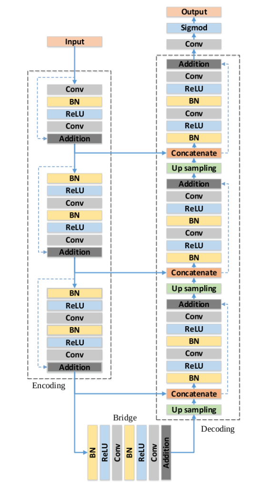

# Salt-Segmentation-using-ResUNet

## Deployed Streamlit App

Access the deployed Streamlit app [here](https://salt-segmentation.streamlit.app/).

# ResUNet: Semantic Segmentation with Residual U-Net

## Overview

ResUNet is a convolutional neural network architecture designed for semantic segmentation tasks. It extends the U-Net architecture by incorporating residual connections for improved training and performance. This repository provides the implementation of ResUNet along with a Streamlit web app for interactive image segmentation.

## Key Features

- U-Net architecture with encoder and decoder paths.
- Residual connections for improved optimization.
- Batch normalization and activation functions.
- Dropout for preventing overfitting.
- Dice coefficient loss for segmentation tasks.

## Architecture

## Web App

The included Streamlit web app allows users to upload images for segmentation using the trained ResUNet model. It provides an interactive way to visualize the segmentation results

